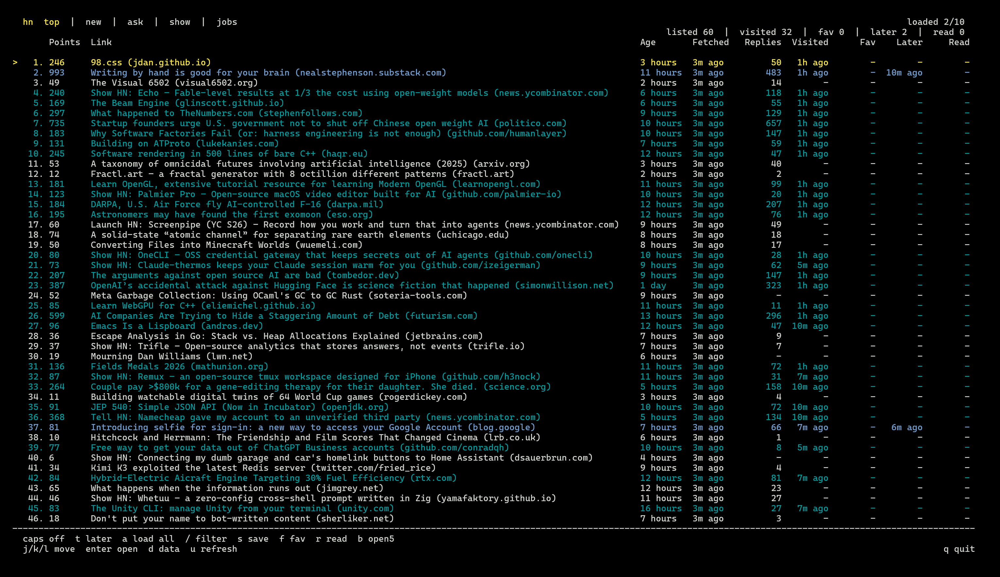

<div align="center">

<h1>HackerNews CLI</h1>

<p>
The original project had become outdated for my use case, so this version is
being expanded and maintained around my own needs.<br>
Feature requests and feedback are welcome through
<a href="https://github.com/fastfingertips/hackernews-cli/issues">GitHub Issues</a>.
</p>

<p>
A terminal interface for browsing and filtering Hacker News feeds while keeping
reading activity on the local machine.
</p>

<p>
  <a href="https://github.com/fastfingertips/hackernews-cli/actions/workflows/tests.yml">
    
  </a>
  
  
</p>



<p>
  <sub>
    The HackerNews CLI <code>v1.0.0</code> main screen, captured in Windows
    Terminal with the
    <a href="https://learn.microsoft.com/en-us/windows/terminal/customize-settings/color-schemes#tango-dark">Tango Dark</a>
    color scheme.
  </sub>
</p>

</div>

## Features

- Top, New, Ask HN, Show HN, and Jobs feeds
- Global tab navigation across feeds and management pages
- Automatic content filling based on terminal height
- Infinite scrolling with background prefetching
- Optional loading of every configured page in the current feed
- Visited, favorite, read, and read-later states
- Detailed, reversible activity history
- Built-in and user-defined saved filters
- Bulk opening of the 5 or 10 highest-scoring untouched links
- Local storage in a single SQLite database
- Terminal-default background for light and dark theme compatibility
- Windows, macOS, and Linux support

## Requirements

- Python 3.9 or later
- `windows-curses` on Windows

Platform-specific dependencies are selected automatically from
`requirements.txt`.

## Installation

Create a virtual environment:

```bash
python -m venv .venv
```

PowerShell:

```powershell
.\.venv\Scripts\Activate.ps1
python -m pip install -r requirements.txt
```

Linux or macOS:

```bash
source .venv/bin/activate
python -m pip install -r requirements.txt
```

## Running

```bash
python main.py
```

Display the installed version:

```bash
python main.py --version
```

## Main screen controls

| Key | Action |
| --- | --- |
| `j` / `k` or arrow keys | Move the selection down or up |
| Left / Right | Move through every top navigation tab |
| `h` / `l` | Move to the previous or next story group |
| `g` / `G` | Jump to the beginning or end of the list |
| `Enter` | Open the selected link |
| `c` | Open the Hacker News discussion |
| `1` - `5` | Change the feed |
| `/` | Open the filter popup |
| `s` | Save the active filter |
| `S` | Open the saved filters page |
| `f` | Toggle favorite |
| `F` | Open Favorites |
| `r` | Toggle read |
| `t` | Toggle read later |
| `T` | Open Read Later |
| `H` | Open activity history |
| `b` / `B` | Bulk-open 5 or 10 links |
| `a` / `A` | Load every configured page in the current feed |
| `d` / `D` | Open local data information |
| `u` / `U` | Refresh the feed from its first page |
| `Space` | Clear the active filter |
| `?` | Open Help |
| `i` / `I` | Open About |
| `q` / `Q` | Quit |

The footer uses two navigation rows. On Windows, it detects Caps Lock and
shows the uppercase or lowercase actions that the keyboard will produce.

## Pagination and bulk opening

The next Hacker News page is prepared in the background. When the selection
reaches the end of the list, the prepared page is appended to the current
table. If the data is not ready, an ASCII loading animation appears on the
last content row.

The application also fills otherwise unused terminal rows. For example, if
the visible area can hold 50 stories, another result group is appended
automatically.

`a` or `A` loads every page configured for the current feed. The default limit
is 10 pages, which is approximately 300 stories at roughly 30 stories per
page.

On the main screen, `b` and `B` sort the loaded, filtered stories by score.
Links with existing visited, favorite, read, or read-later activity are
skipped. More pages are loaded when there are not enough eligible links.

## Filters

The filter popup opens over the current table:

- `Enter` applies the query.
- `Esc` discards the changes.
- `Ctrl+U` clears the input.

Free text is matched against the title, domain, and submitter. Quoted phrases
are treated as a single value. Prefix a condition with `-` to exclude it.

Supported fields:

| Field | Example |
| --- | --- |
| Title | `title:"open source"` |
| Domain | `site:github.com` |
| Submitter | `by:pg` |
| Score | `points:>=100` |
| Comments | `replies:>50` |
| Visited state | `is:visited`, `is:unvisited` |
| Favorite state | `is:fav`, `is:unfav` |
| Read state | `is:read`, `is:unread` |
| Read-later state | `is:later`, `is:unlater` |

Examples:

```text
python is:unread points:>=100
title:"open source" -site:example.com
by:pg replies:>50 is:unvisited
```

Press `s` to save the active query under a name in the SQLite database. Press
`S` to open built-in and custom filters in a table. On that page:

- `Enter` applies the selected filter.
- `n` creates a custom filter.
- `e` edits a custom filter.
- `d` deletes a custom filter.
- `/` searches filter names and queries.

Built-in filters cannot be edited or deleted.

## History, Favorites, and Read Later

History stores link opens, favorite changes, read changes, and read-later
changes as separate events. Its time column combines the full local timestamp
with a relative value:

```text
2026-07-24 15:30:00 (5m ago)
```

Favorite, read, and read-later changes can be undone from History with `u`.
Undo does not rewrite the original event; it creates a linked inverse event,
preserving the activity log.

History supports these filter fields:

```text
title: url: action: after:YYYY-MM-DD before:YYYY-MM-DD
```

Favorites and Read Later use the same table layout as the main screen. On the
Read Later page:

- `Enter` opens the selected link.
- `r` toggles its read state.
- `b` / `B` opens 5 or 10 unread links.
- `t` / `d` removes it from the list.
- `/` filters the list.

Read Later bulk opening skips links that have already been visited or read and
moves the selection to the opened rows.

## Main table columns

- `Points`: Hacker News score
- `Link`: title and domain
- `Age`: age of the Hacker News submission
- `Fetched`: time when the application fetched the record
- `Replies`: comment count
- `Visited`: most recent visit time
- `Fav`: time added to Favorites
- `Later`: time added to Read Later
- `Read`: time marked as read

State timestamps use relative values such as `5m ago`, `3h ago`, or `2d ago`.

## Local data

All user data is stored in one file:

```text
hackernews-cli-data.sqlite3
```

The database is placed in the operating system's standard application data
directory through `platformdirs`. Press `d` to view its exact location, file
size, and stored data groups. Press `o` on that screen to open the database
directory in the system file manager.

The database contains:

- History events
- Favorites
- Read state
- Read Later
- Saved filters

There is no cloud synchronization, and the SQLite file is not encrypted by
the application. Back up the data by copying
`hackernews-cli-data.sqlite3`.

## Runtime libraries

- `httpx`: HTTP/2, connection pooling, and network requests
- `beautifulsoup4`: Hacker News HTML parsing
- `platformdirs`: platform-appropriate application data paths
- `curses` / `windows-curses`: terminal user interface

## Project structure

```text
hackernews_cli/
  app/          application state, input routing, and run loop
  data/         SQLite schema and repositories
  hn/           Hacker News models, client, and HTML parser
  services/     pagination, activity, and link-opening behavior
  ui/
    pages/      interactive full-screen pages
    components/ shared table, header, content, and footer components
    terminal/   curses drawing and input utilities
```

Full-screen pages share one frame: a two-row header, content sized to the
terminal height, and a two-row navigation footer.

## Tests

```bash
python -m unittest discover -s tests -v
```

The GitHub Actions test matrix covers Python 3.9 through 3.13 on Windows and
Linux.

## License

This project is available under the [MIT License](LICENSE).

---

> Documentation notice: This README was prepared with AI assistance and may
> contain mistakes, omissions, or outdated details. Please report documentation
> issues through [GitHub Issues](https://github.com/fastfingertips/hackernews-cli/issues).
